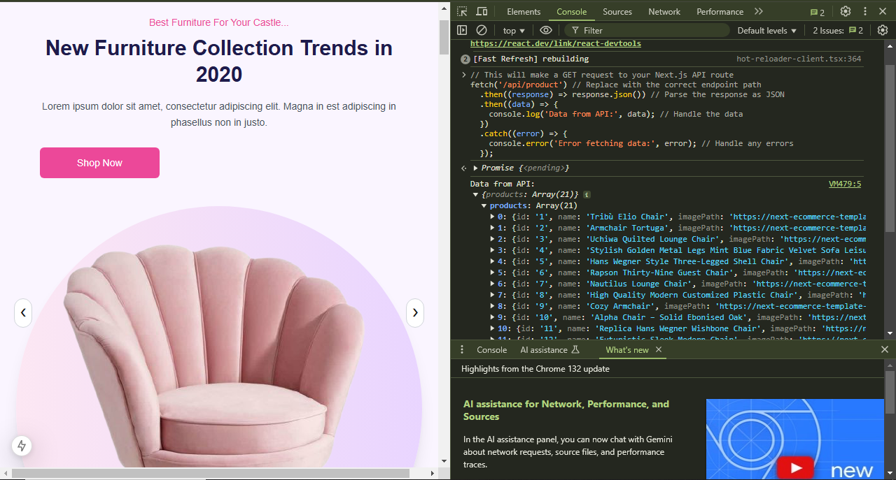

## API Integration Report

API Used
- API Endpoint: https://next-ecommerce-template-4.vercel.app/api/product
- Purpose: To fetch product data, including name, price, image, description, category, and other attributes.

Sanity Setup
- Command Used for Setup:
  ```bash
   npm create sanity@latest -- --project 84ovqw5z --dataset production --template clean
   ```
Schema Folder Structure:
- schemaTypes/index.ts:
```bash
import { type SchemaTypeDefinition } from 'sanity';
import ProductSchema from './product';

export const schema: { types: SchemaTypeDefinition[] } = {
  types: [ProductSchema],
};
```

- schemaTypes/product.ts:
```bash
export default { 
  name: 'product',
  type: 'document',
  title: 'Product',
  fields: [
    {
      name: 'name',
      type: 'string',
      title: 'Name',
      validation: (Rule: any) => Rule.required().error('Name is required'),
    },
    {
      name: 'image',
      type: 'image',
      title: 'Image',
      options: {
        hotspot: true,
      },
      description: 'Upload an image of the product.',
    },
    {
      name: 'price',
      type: 'string',
      title: 'Price',
      validation: (Rule: any) => Rule.required().error('Price is required'),
    },
    {
      name: 'description',
      type: 'text',
      title: 'Description',
      validation: (Rule: any) =>
        Rule.max(150).warning('Keep the description under 150 characters.'),
    },
    {
      name: 'discountPercentage',
      type: 'number',
      title: 'Discount Percentage',
      validation: (Rule: any) =>
        Rule.min(0).max(100).warning('Discount must be between 0 and 100.'),
    },
    {
      name: 'isFeaturedProduct',
      type: 'boolean',
      title: 'Is Featured Product',
    },
    {
      name: 'stockLevel',
      type: 'number',
      title: 'Stock Level',
      validation: (Rule: any) => Rule.min(0).error('Stock level must be a positive number.'),
    },
    {
      name: 'category',
      type: 'string',
      title: 'Category',
      options: {
        list: [
          { title: 'Chair', value: 'Chair' },
          { title: 'Sofa', value: 'Sofa' },
        ],
      },
      validation: (Rule: any) => Rule.required().error('Category is required'),
    },
  ],
};
```

## Integration Process

1. API Data Fetching:

- Used Axios to fetch data from the API.
- Endpoint: ```bash https://next-ecommerce-template-4.vercel.app/api/product ```

2. Image Upload to Sanity:

- Used ``` @sanity/client ``` to upload product images to Sanity.
- Images were fetched from URLs, converted into buffers, and uploaded to Sanity's assets.

3.Product Data Transformation:

- API data fields were mapped to the Sanity schema fields.
- For example, the ``` category ```,``` price ```, and ``` description ``` fields from the API were mapped directly to the corresponding Sanity fields.

4.Sanity Client Setup:

- Configured the Sanity client in ``` importData.js ```:
```bash
const client = createClient({
  projectId: process.env.NEXT_PUBLIC_SANITY_PROJECT_ID,
  dataset: process.env.NEXT_PUBLIC_SANITY_DATASET,
  token: process.env.SANITY_API_TOKEN,
  apiVersion: '2025-01-15',
  useCdn: false,
});
```

5.Data Import:

- Iterated over API data.
- Uploaded images (if available) and linked them to product documents.
- Created and uploaded product documents to Sanity.

## Code for Data Import

The complete ``` importData.js ``` script is as follows:
```bash
import { createClient } from '@sanity/client';
import axios from 'axios';
import dotenv from 'dotenv';
import { fileURLToPath } from 'url';
import path from 'path';

const __filename = fileURLToPath(import.meta.url);
const __dirname = path.dirname(__filename);
dotenv.config({ path: path.resolve(__dirname, '../../.env') });

const client = createClient({
  projectId: process.env.NEXT_PUBLIC_SANITY_PROJECT_ID,
  dataset: process.env.NEXT_PUBLIC_SANITY_DATASET,
  token: process.env.SANITY_API_TOKEN,
  apiVersion: '2025-01-15',
  useCdn: false,
});

async function uploadImageToSanity(imageUrl) {
  try {
    const response = await axios.get(imageUrl, { responseType: 'arraybuffer' });
    const buffer = Buffer.from(response.data);
    const asset = await client.assets.upload('image', buffer, {
      filename: imageUrl.split('/').pop(),
    });
    return asset._id;
  } catch (error) {
    console.error('Failed to Upload Image:', error);
    return null;
  }
}

async function importData() {
  try {
    const response = await axios.get("https://next-ecommerce-template-4.vercel.app/api/product");
    const products = response.data.products;

    for (const item of products) {
      const imageRef = item.imagePath
        ? await uploadImageToSanity(item.imagePath)
        : null;

      const sanityItem = {
        _type: 'product',
        name: item.name,
        category: item.category || null,
        price: item.price,
        description: item.description || '',
        discountPercentage: item.discountPercentage || 0,
        stockLevel: item.stockLevel || 0,
        isFeaturedProduct: item.isFeaturedProduct,
        image: imageRef
          ? {
              _type: 'image',
              asset: {
                _type: 'reference',
                _ref: imageRef,
              },
            }
          : undefined,
      };

      const result = await client.create(sanityItem);
      console.log(`Uploaded: ${result._id}`);
    }
  } catch (error) {
    console.error('Error Importing Data:', error);
  }
}

importData();
```

## API calls in Browser
- Using fetch API:
```bash
// This will make a GET request to your Next.js API route
fetch('/api/your-endpoint') // Replace with the correct endpoint path
  .then((response) => response.json()) // Parse the response as JSON
  .then((data) => {
    console.log('Data from API:', data); // Handle the data
  })
  .catch((error) => {
    console.error('Error fetching data:', error); // Handle any errors
  });
```

## API Call



## Sanity Fields


## Frontend View
