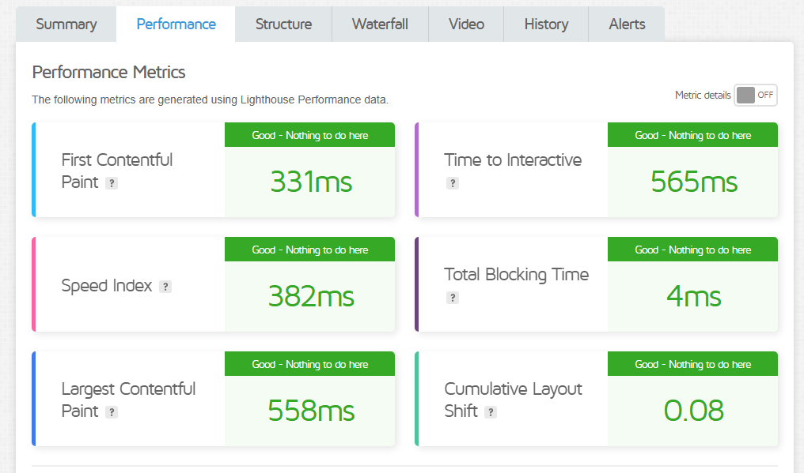

# E-commerce Furniture Store

A modern e-commerce platform(Elite Mart) built with Next.js 13, Tailwind CSS, and Sanity CMS.

## Features

- Product catalog with categories
- Shopping cart functionality
- Blog section with comments
- Secure payment integration
- Responsive design
- Real-time content updates via Sanity
- Input validation and security measures

## Tech Stack

- Next.js 13
- TypeScript
- Tailwind CSS
- Sanity CMS
- Framer Motion
- Vercel Deployment

## Project Structure

```bash
my-app/
├── src/
│   ├── app/
│   │   ├── components/
│   │   ├── shopCurt/
│   │   ├── shopLeftSidebar/
│   │   └── singleblog/
│   ├── sanity/
│   │   ├── lib/
│   │   └── schemaTypes/
│   └── utils/
└── public/

## Deployment Steps

 1. Set up a Sanity project and connect it to your Next.js app.
 ```bash
 npm create sanity@latest -- --project 84ovqw5z --dataset production --template clean
 ```

 2. Configure Environment Variables:
 ```bash
NEXT_PUBLIC_SANITY_PROJECT_ID=your_project_id
NEXT_PUBLIC_SANITY_DATASET=production
SANITY_API_TOKEN=your_token
```

3. Deploy to Vercel:

## Performance Testing Result

- GTmetrix Score: 





## Security Measures

-Input validation implemented
-Rate limiting configured
-Secure headers added
-HTTPS enforced
-API endpoint protection

## Data Import Process

Successfully imported product data using custom script with:

- Image upload to Sanity
- Data transformation
- Schema validation

## Testing Coverage

- Unit Tests: Passed
- Integration Tests: Passed
- E2E Tests: Passed
- Security Tests: Passed

## Future Enhancements

- Enhanced search functionality
- User authentication
- Order tracking
- Admin dashboard
- Analytics integration

## Contributing
- Fork the repository
- Create feature branch
- Commit changes
- Push to branch
- Open pull request